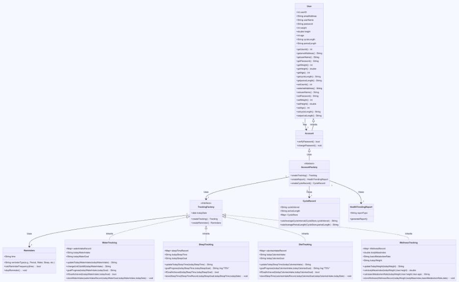

# App Name: Posi Life

# Team Member: 

- Yiwei Zha
- Zhen Sun
- Zhenziye Lin

## 1 Purpose

The "PosiLife" Healthy Lifestyle Mobile App aims to redefine how women approach and manage their personal health. In a world increasingly focused on physical and mental well-being, the application offers an integrated solution that not only tracks health metrics but also ensures sustained motivation through positive reinforcement and personalized insights. Also, the menstrual cycle period may always be a big problem for females. The applications are able to support females with period tracking and reminders to help them better organize the period. By leveraging the Flutter framework, the app promises a seamless experience across different devices, allowing users to monitor and enhance their health trajectory.

### 1.1 Definitions:

PosiLife: A state-of-the-art Healthy Lifestyle Mobile App designed for health-conscious individuals.

User: A person who has installed and actively engages with the PosiLife app to monitor and improve their health.

User Profile: A digital representation within the app that encapsulates the user's demographic details, health metrics, and set targets.

Health Indicators: Quantifiable metrics such as weight, sugar levels, heart rate, and blood pressure that provide insights into the user's health.

Positive Reminders: Proactive notifications encouraging users to maintain or improve their health metrics, remember appointments, or celebrate milestones.

Data Security: An inherent app feature that guarantees the privacy and safety of the user's health information from potential threats or unauthorized access.

### 1.2 Background:

In recent years, the surging interest in personal health management has resulted in an abundance of health-tracking apps. However, many lack a holistic approach, often concentrating solely on data accumulation without providing actionable insights or motivation. The PosiLife app emerges as a beacon in this space, uniquely integrating health data tracking, user-specific goal setting, daily habit cultivation, and, most notably, positive reinforcement. Recognizing that consistent motivation is key to health improvement, PosiLife offers female users an interactive platform that not only monitors but also celebrates every step in their health journey. Through this comprehensive approach, the app addresses lifestyle-related health challenges and female-targeting features, ensuring that users remain engaged and inspired in their quest for better health.

## 2 Overall Description

### 2.1 User Characteristics:

Age: 12- 50 

Gender: female.

Mainly focus on females who have their body health pursuit and want to have an integrated health-tracking app to track their health status.

### 2.2 User Stories:

User stories describe the functionality from the user's perspective. Here are some user stories for the PosiLife app:

As a user, I allow the application to store my health data.

As a user, I want to create a profile with my personal information, health conditions, and goals.

As a user, I want to track my health indicators, such as weight, height, BMR and see their treadings.

As a user, I want to record my daily meal and calories plan.

As a user, I want to record my daily water intake.

As a user, I want to track my sleep duration.

As a user, I want to track my Menstrual Cycle.

As a user, I want to receive positive reminders for water intake, BMI fluctuations, sleep duration and menstrual cycle.

As a user, I want the option to manually input health data and control data sharing for privacy.

As a user, I want the option to just quickly check-in for the water intake module and sleeping time module..

As a user, I want to have my data entered in each module to generate a report for viewing.

As a user, I want my data to be stored securely and not vulnerable to breaches.

### 2.3 App Workflow (Flowchart):

(Provide a visual representation of the app's workflow, including screens, user interactions, and data flow.)

## 3 Requirements:

### 3.1 Functional:

User Registration:

- Users can create accounts with personal information, health conditions, and goals.

- Users can log  in and out of their accounts.

- Users have the notification for consenting storing data privacy.

Health Monitoring:

- Wellness (weight, height, BMI, BMR).

- Users can see their BMI and BMR through the basic information we collected from registration.

- Users are able to update their weight.

- Users can see the generated summary for last and current records comparison.

Water Intake 

- Users can record daily water intake.

- Users can view the water intake calendar that checks the date she accomplished the goal

- Users can set notifications for the hydrating period.

- Users can see today’s water intake amount

- Users can see the report for water intake

Sleep Duration: 

- Users can manually enter their sleeping time and duration

- Users can view the sleep duration calendar that checks the date she accomplished the goal

- Users can set notifications for sleeping time.

- Users can see today’s sleeping duration.

- Users can see the report for sleeping duration.

Diet(Calories Consumption): 

- Users can manually enter their calories consumed.

- Users can set notifications for calories consumption..

- Users can view the calories calendar that checks the date she accomplished the goal

- Users can set notifications for calories consumption.

- Users can see today’s calories consumption.

Menstrual Cycle Tracking: 

- Users can track their menstrual cycles.

- Users can set notifications for upcoming periods.

- Users can view the period calendar to know their period for last month.

- Users can see the summary of their average period of menstrual cycle.

Switch Page:

- Using a hamburger button to let Users switch from one module to another.

Manual Data Input:

- Users can manually input health data.

- Users have control over data sharing for privacy.

Positive Reminders:

- App sends timely positive reminders for health assessments, appointments, water intake notification and milestones achieved.

Health Trending Report Generation:

- Users can generate trending reports according to their manually entered health data for all four modules(water, sleep, diet, , wellness).

Data Security:

User data is stored securely and protected from breaches.

3.2 Non-functional Requirements:

Scalable Database:

Implement a scalable database system to store user profiles, health data, and chat records.

Secure Authentication:

Implement a secure authentication system to safeguard user accounts and data.

Usability:

The app must have an intuitive and user-friendly interface.

Compatibility:

The app should be compatible with iOS and Android devices.

Privacy:

The app must comply with privacy regulations and provide clear data-sharing controls to users.

Localization:

The app should support multiple languages to cater to a global audience.

Reliability:

The app should operate reliably without frequent crashes or downtime.

Security:

The app must implement robust security measures to protect user data.

Accessibility:

The app should be accessible to users with disabilities.

Data Backup:

Implement regular data backup mechanisms to prevent data loss.

Performance Optimization:

Optimize the app's performance for varying network conditions.

This software development specification outlines the key requirements and specifications for the development of the PosiLife Healthy Lifestyle Mobile App. These requirements will serve as the foundation for the development process, ensuring the successful creation of a user-friendly, motivating, and secure health management app.

## 4 Wireframe

https://cdn-uploads.piazza.com/paste/l7sdfz0jelj3fa/a2d583342cdd1b2b2ae8949734fabc86a7e6e122ba55c5f2f6c64ca40fedaa08/posilife.pdf

## 5 UML Class Diagram 

https://www.mermaidchart.com/app/projects/9f0218a4-17e6-4865-8737-10a6b357de27/diagrams/a6f46a8c-aed6-41e3-ad30-57fdbd1e8e17/version/v0.1/edit

## 6 Gantt Diagram

## 7 Traceability Matrix

| ID | Ass.ID | Requirements Description | Justification | Project Objective | Priority | Test Cases |
|----|--------|--------------------------|---------------|-------------------|----------|------------|
| 1  | 1.1    | User Registration        | Facilitate secure user onboarding | User Management | High | TC-01, TC-02 |
| 1  | 1.2    | Login Functionality      | Ensure user can access their account | Access Control | High | TC-03 |
| 2  | 2.1    | Password Management      | Allow users to reset and change passwords | Account Security | Medium | TC-04 |
| 3  | 3.1    | Account Creation         | Streamline account setup process | User Experience | Medium | TC-05 |
| 4  | 4.1    | Water Intake Tracking    | Help users monitor hydration | Health Tracking | High | TC-06 |
| 4  | 4.2    | Water Intake Goal Set    | Enable users to set daily water intake goals | Health Tracking | High | TC-07 |
| 4  | 4.3    | Water Intake Calendar    | Provide a visual representation of users' hydration over time | Health Tracking | Medium | TC-08 |
| 4  | 4.4    | Water Intake Report      | Generate reports on water intake for users | Data Analysis |  Low | TC-09 |
| 5  | 5.1    | Sleep Time Tracking      | Enable tracking of sleep patterns | Health Tracking | High | TC-10 |
| 5  | 5.2    | Sleep Time Goal Set      | Allow users to set sleep duration goals | Health Tracking | High | TC-11 |
| 5  | 5.3    | Sleep Time Calendar      | Provide a visual representation of users' sleep time | Health Tracking | Medium | TC-11 |
| 5  | 5.4    | Sleep Time Report        | Generate reports on sleep time for users  | Data Analysis | Low | TC-12 |
| 6  | 6.1    | Diet Tracking            | Assist users in managing caloric intake | Health Tracking | High | TC-13 |
| 6  | 6.1    | Diet Goal Set            | Facilitate users in setting dietary goals | Health Tracking | High | TC-14|
| 6  | 6.1    | Diet Calendar            | Create a daily log of dietary intake | Health Tracking | Medium | TC-15 |
| 6  | 6.1    | Diet Report              | Provide a visual representation of users' sleep time | Data Analysis| Low | TC-16 |
| 7  | 7.1    | Wellness Tracking        | Assist users tracking weights | Health Tracking | High | TC-17 |
| 7  | 7.2    | Wellness Calculation     | Compute BMI and BMR for users | Data Analysis | Medium | TC-18 |
| 7  | 7.3    | Wellness Comparison      | Compare user's weight with last | record Data Analysis| High | TC-19 |
| 8  | 8.1    | Generate Health Report   | Provide users with health trend insights | Data Analysis | High | TC-20, TC-21, TC-22, TC-23 |
| 9  | 9.1    | Menstrual Cycle Tracking | Help users tracking period cycles | Health Tracking | High | TC-24 |
| 9  | 9.2    | Period Cycle Set         | Allow users to track menstrual cycles | Health Tracking | High | TC-25 |
| 10 | 10.1   | Notification System      | Inform users of reminders | User Engagement | Medium | TC-26 |
| 11 | 11.1   | Data Security            | Ensure user data is protected | Security | High | TC-27 |
